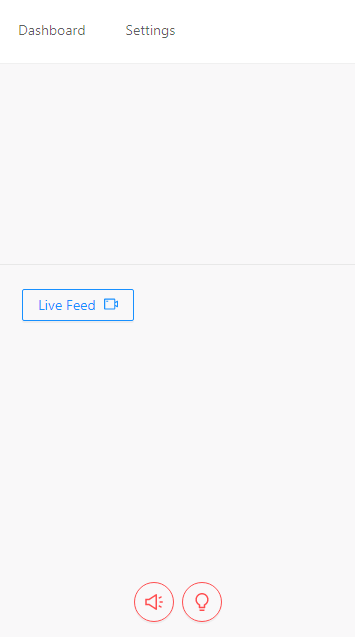
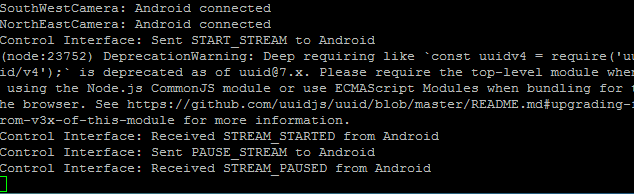
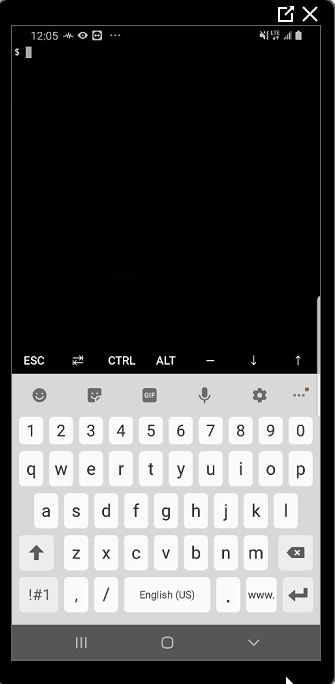

# remote-security

A remote security app using an android phone.

## Objectives
1) Turn on/off an alarm siren. 
2) Turn on/off a set of lights.
3) View a security camera's stream. 
4) View previously recorded motion events. 
5) Receive push notifications when motion is detected.
6) View the system status(cameras, voltage of the system, etc).
7) Package all these features into a single app.

## Challenges
In short, the challenges can be boiled down to 3 things.
1) No wired power.
2) No wired internet connection.
3) Abysmal camera API documentation and support.

## The End Result
An old android phone running a Node.js server(via Termux) is used to connect to a set of Reolink cameras , as well as a ESP8266 nodeMCU wifi controller. A DigitalOcean Droplet running a Node.js server is used to server a React application and send/receive data to/from the Android phone. Users can then view camera streams, turn on/off the alarm siren and lights, monitor the voltage of the system, etc.

**An important thing to note**

The Android phone uses a conventional SIM card to connect to the internet, which has the side effect of placing the Android phone behind a Carrier Grade NAT(CGNAT). This means that the phone can **NOT** receive inbound connections. Therefore, in order to communicate with the phone in any useful way, a persistent connection must be established between the Droplet server and the Android phone. Additionally, the connection **MUST** be opened by the Android phone first. 

The solution to the above problem is a "control" or "command" connection(called a "control-interface" in this application). The control-interface lets the Droplet server communicate and send/receive commands from the Android phone.

However, we face yet another problem. The Droplet is not *actually* inside of the Android's Local Area Network(LAN), it can only send/receive data from the Android. This means that if we want to send commands to the cameras(like start an RTSP stream), we must tell the Android to send the command to the camera and then have the Android send us the result(a stream of data). This architecture is the same for sending/receiving data to/from the nodeMCU.

This can be seen in the gifs below.

Responses received from the the Android phone

---
Command received from the Droplet server

